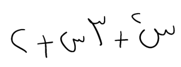
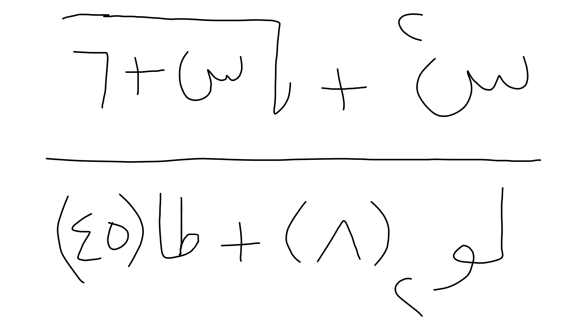
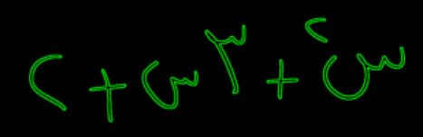
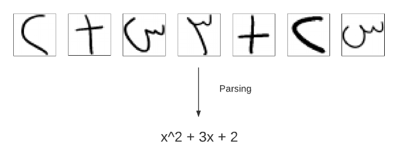

# Arabic Math Solver - Server Side

is a flask web app which recognizes sent image of an Arabic mathematical expression
through characters' segmentation, characters recognition, and parsing them into a mathematical
expression then apply an operation on it e.g (solving the roots of polynomial, integration, etc).

## Table of Contents

- [Examples](#examples)
- [Getting Started](#getting-started)
  - [Prerequisites](#prerequisites)
  - [Installation](#installation-for-windows)
  - [Usage](#usage)
- [Main Components](#main-components)
  - [Segmentation](#segmentation)
  - [Recognition](#recognition)
  - [Parsing](#parsing)
  - [Output](#output)
- [Related Projects](#related-projects)
- [License](#license)

## Examples
| Expression Image                                        |                            HTML Recognition Output                             |
|:--------------------------------------------------------|:------------------------------------------------------------------------------:|
|   |                 <html><body>س ٢+٣*س+٢</body></html>                 | 
|  | <html><body>(لـو٢(٨)+ظا(٤٥))\\(س ٢+√(س+٦))</body></html> |

## Getting Started
### Prerequisites
- python >= 3.8.12

### Installation (For windows)
1. Clone the repo

`git clone git@github.com:omarshawky15/ArabicMathSolver-Server.git`

2. Create a virtual environment

`python -m venv venv`

3. Activate the virtual environment

`source venv/Scripts/activate`

4. Install the required packages

`pip install -r requirements.txt`

### Usage
- To start the local server, run

`python app.py`

then upload the image to the server and see the html output. (Default 
operation: solving the roots of polynomial)

- To use without running the server, uncomment the `runLocal()` function
 in `app.py`, insert the image path, and comment `app.run()`.

## Main Components
### Segmentation
The image is partitioned into multiple cropped characters by analyzing their 
contours using [OpenCV](https://opencv.org/).

### Recognition
Each character is recognized using our trained tensorflow model which 
consists of the following layers.

|     Layer (type)     |    Output Shape     | Param # |
|:--------------------:|:-------------------:|:-------:|
| (BatchNormalization) |  (None, 32, 32, 1)  |    4    |
|       (Conv2D)       | (None, 32, 32, 64)  |  1664   |
|       (Conv2D)       | (None, 32, 32, 64)  | 102464  |
|    (MaxPooling2D)    | (None, 16, 16, 64)  |    0    |
|      (Dropout)       | (None, 16, 16, 64)  |    0    |
|       (Conv2D)       | (None, 16, 16, 128) |  73856  |
|       (Conv2D)       | (None, 16, 16, 128) | 147584  |
|    (MaxPooling2D)    |  (None, 8, 8, 128)  |    0    |
|      (Dropout)       |  (None, 8, 8, 128)  |    0    |
|      (Flatten)       |    (None, 8192)     |    0    |
|      (Dropout)       |    (None, 8192)     |    0    |
|       (Dense)        |     (None, 256)     | 2097408 |
|       (Dense)        |     (None, 43)      |  11051  |

### Parsing
Symbols are parsed together to form a mathematical expression where 
different combinations are handled like fraction, power, square root, ..etc

### Output
The chosen operation (integration, differentiation, etc.) is applied on the mathematical 
expression using [SymPy](https://www.sympy.org/) which is a library for symbolic mathematics.
Then both the expression and the operation output are translated back to Arabic mathematical
notation.

## Related Projects
[Arabic Math Solver - Android App](https://github.com/omarshawky15/ArabicMathSolver-AndroidApp)

## License
This application is released under GNU GPLv3 (see [LICENSE](LICENSE)).

For more details, see [the graduation project book.](Graduation_Project_Book.pdf)
